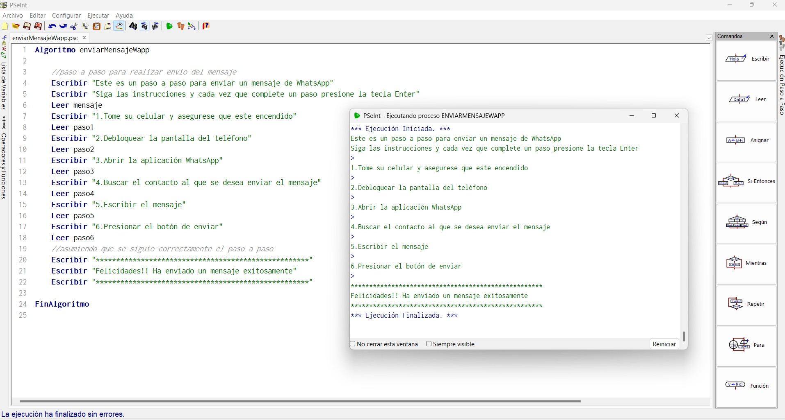
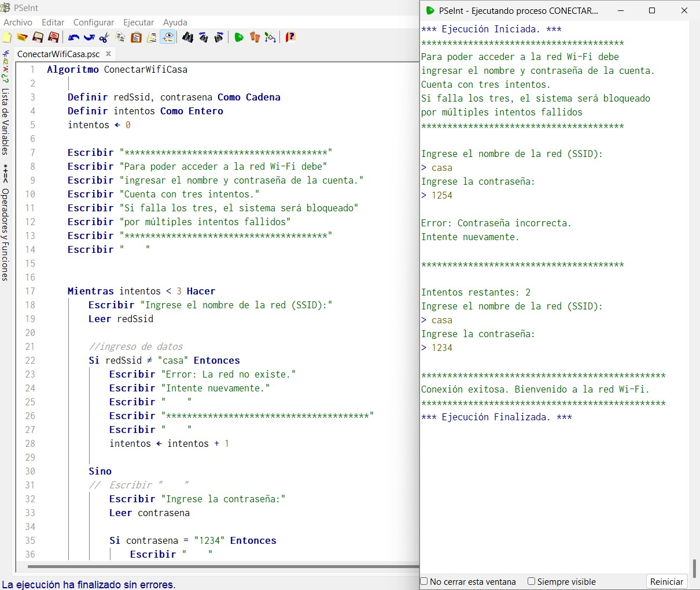
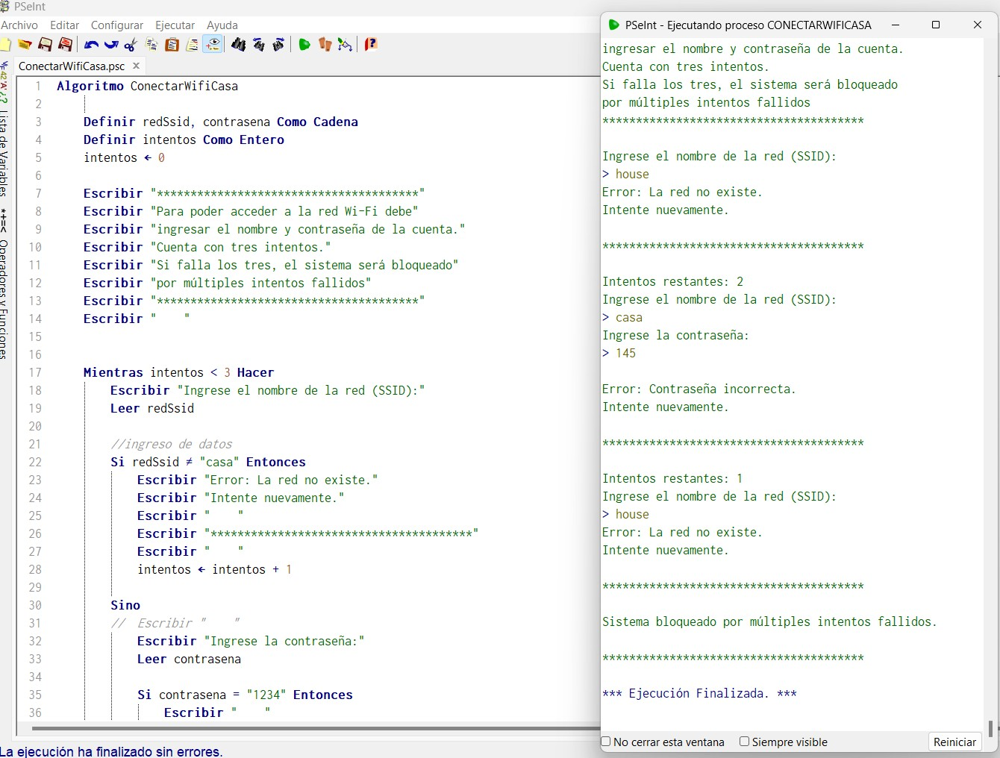
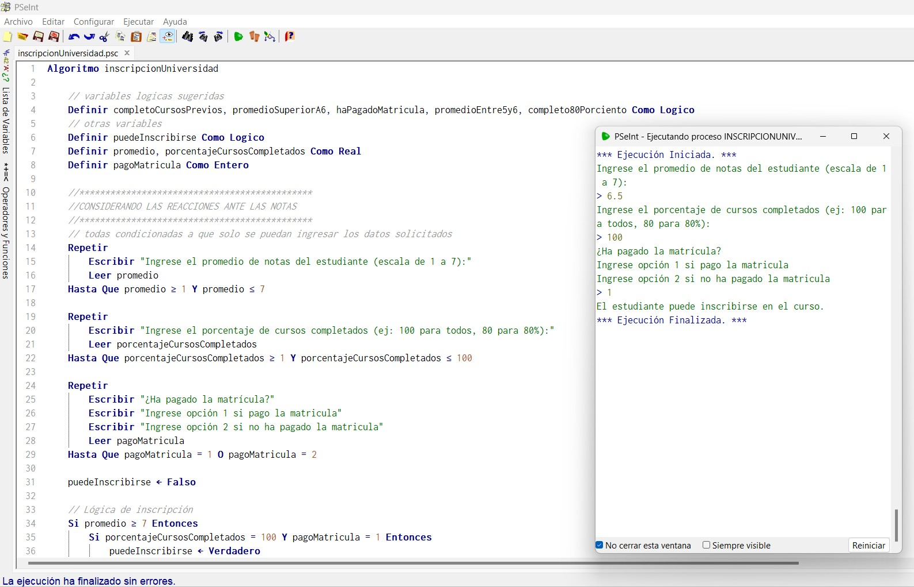
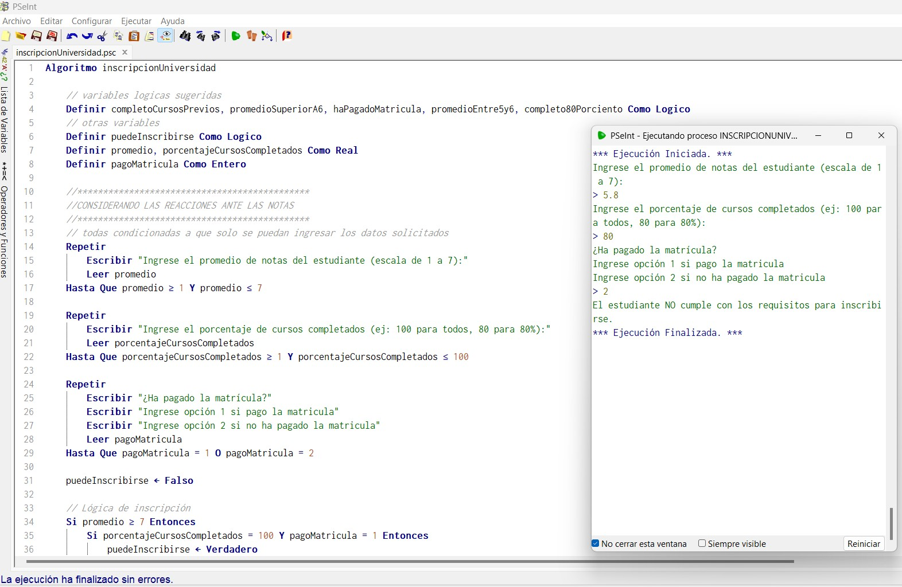
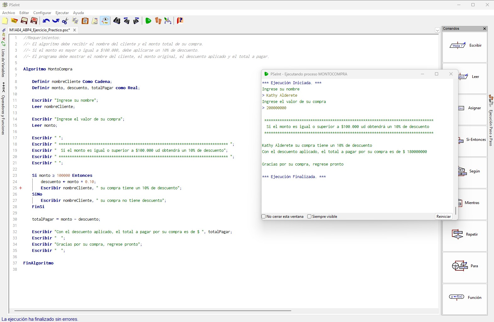

**_<h1 align="center">:vulcan_salute: Ejercicios con Pseint :computer:</h1>_**

**<h2>1. &#128172; Instrucciones mensaje WhatsApp</h2>**(https://github.com/KathyAlde21/ejerciciosPseint/blob/main/ejercicio_practico_1/enviarMensajeWapp.psc)
- Proyecto en que se indican los pasos que se deben seguir para enviar un mensaje de WhatsApp:

[**<h2>2. &#128246; Conectar a Wifi</h2>**](https://github.com/KathyAlde21/ejerciciosPseint/blob/main/ejercicio_practico_2/ConectarWifiCasa.psc)
- Para poder conectar a una red de internet se requiere del nombre de usuario y contraseña correctos.
- Se plantea con 3 intentos los dos posibles resultados:

 

[**<h2>3. :student: Matricula Universitaria</h2>**](https://github.com/KathyAlde21/ejerciciosPseint/blob/main/ejercicio_practico_3/inscripcionUniversidad.psc)
- De acuerdo a instrucciones asociadas al promedio de notas, asistencia y pago de matricula, se evalua ingreso de estudiantes.
- Se aplico a dos casos para ver los dos tipos de resultado:

 

[**<h2>4. &#128176; Descuento en Compra</h2>**](https://github.com/KathyAlde21/ejerciciosPseint/blob/main/ejercicio_practico_4/descuento10porciento.psc)
- Se solicitan datos para realizar descuento al valor total de la compra.
- El descuento es del 10% por compras superiores a cien mil pesos.

